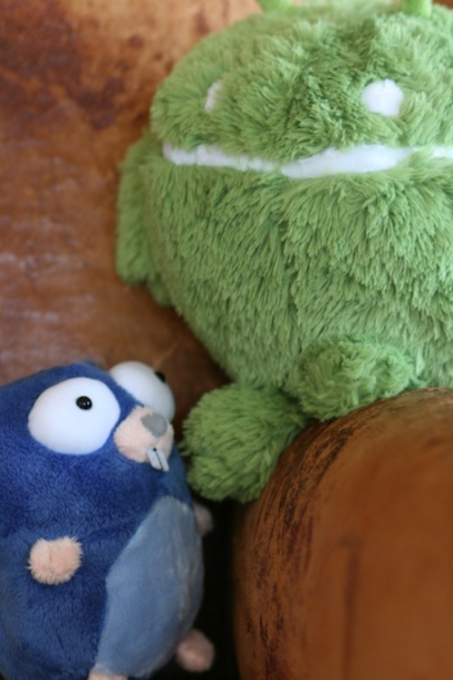

# 简单二次封装的golang图像处理库:图片裁剪

[English Version Here](README_EN.md)

## 功能

1. Go语言下的官方图像处理库，貌似已经找不到了，所以收藏起来
2. 简单封装后对jpg和png图像进行缩放|裁剪的库

## 最新支持

- 2019/5/12 支持传入图片字节数组来进行裁剪。

## 使用说明

### 首先下载

```
go get -v -u github.com/gimaaa/go_image
```

### 主要函数

- 按宽度进行比例缩放，输入和输出都是图片字节数组:

```
func ScaleB2B(InRaw []byte, width int) (OutRaw []byte, err error)
```

- 按宽度进行比例缩放，输入输出都是文件:

```
func ScaleF2F(filename string, savepath string, width int) (err error)
```

- 按宽度和高度进行比例缩放，输入和输出都是图片字节数组:

```
func ThumbnailB2B(InRaw []byte, width int, height int) (OutRaw []byte, err error)
```

- 按宽度和高度进行比例缩放，输入和输出都是文件:

```
func ThumbnailF2F(filename string, savepath string, width int, height int) (err error)
```

- 检测图像文件真正文件类型,并返回真实文件名,参数为图像文件位置

```
func RealImageName(filename string) (filerealname string, err error)
```

- 文件改名,如果force为假,且新的文件名已经存在,那么抛出错误

```
func ChangeImageName(oldname string, newname string, force bool) (err error) 
```

## 使用示例

### example_test.go

```
package go_image

import (
	"fmt"
	"testing"
)

//将某一图片文件进行缩放后存入另外的文件中
func TestImage(t *testing.T) {
	//打印当前文件夹位置
	fmt.Printf("本文件文件夹位置:%s\n", CurDir())

	//图像位置
	filename := "./testdata/gopher.png"

	//宽度,高度
	width := 500
	height := 800

	//保存位置
	save1 := "./testdata/gopher500.jpg"
	save2 := "./testdata/gopher500_800.png"

	//按照宽度进行等比例缩放
	err := ScaleF2F(filename, save1, width)
	if err != nil {
		fmt.Printf("生成按宽度缩放图失败：%s\n", err.Error())
	} else {
		fmt.Printf("生成按宽度缩放图：%s\n", save1)
	}

	//按照宽度和高度进行等比例缩放
	err = ThumbnailF2F(filename, save2, width, height)
	if err != nil {
		fmt.Printf("生成按宽度高度缩放图:%s\n", err.Error())
	} else {
		fmt.Printf("生成按宽度高度缩放图:%s\n", save2)
	}

	//查看图像文件的真正名字
	//如 ./testdata/gopher500.jpg其实是png类型,但是命名错误,需要纠正!
	realfilename, err := RealImageName(save1)
	if err != nil {
		fmt.Printf("真正的文件名: %s->? err:%s\n", save1, err.Error())
	} else {
		fmt.Printf("真正的文件名:%s->%s\n", save1, realfilename)
	}

	//文件改名,强制性
	err = ChangeImageName(save1, realfilename, true)
	if err != nil {
		fmt.Printf("文件改名失败:%s->%s,%s\n", save1, realfilename, err.Error())
	} else {
		fmt.Println("改名成功")
	}

	//文件改名,不强制性
	err = ChangeImageName(save1, realfilename, false)
	if err != nil {
		fmt.Printf("文件改名失败:%s->%s,%s\n", save1, realfilename, err.Error())
	}
}

```

### 结果

```
=== RUN   TestImage
本文件文件夹位置:E:\gocode\src\github.com\hunterhug\go_image
生成按宽度缩放图：./testdata/gopher500.jpg
生成按宽度高度缩放图:./testdata/gopher500_800.png
真正的文件名:./testdata/gopher500.jpg->./testdata/gopher500.png
改名成功
文件改名失败:./testdata/gopher500.jpg->./testdata/gopher500.png,File already exist error
--- PASS: TestImage (1.66s)
PASS
```

原始图片:


宽度500px等比例缩放裁剪:




宽度500px,高度800px等比例缩放裁剪:


## 来自

This is a Graphics library for the Go programming language.

Unless otherwise noted, the graphics-go source files are distributed
under the BSD-style license found in the LICENSE file.

Contributions should follow the same procedure as for the Go project:
http://golang.org/doc/contribute.html

